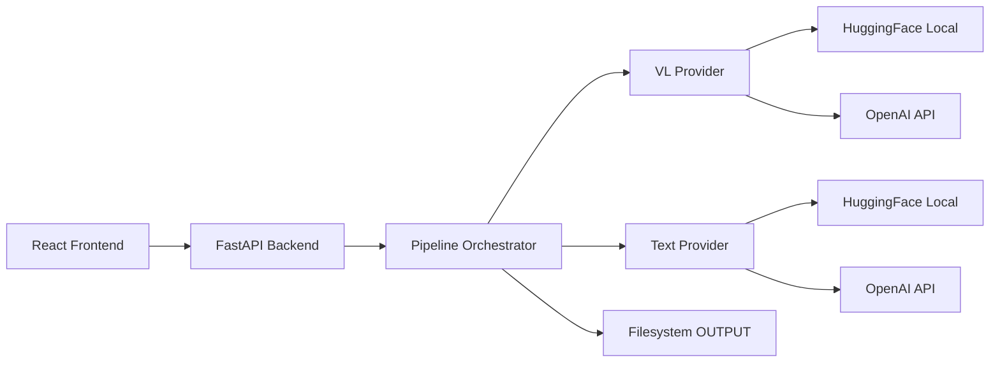

# Architecture

## System Overview

Mnemosine is a full-stack application for manuscript analysis:



## Component Diagram

| Component | Responsibility |
|-----------|---------------|
| `config.py` | Centralized settings from `.env`, device detection |
| `models_catalog.py` | Model registry with GPU gating rules |
| `model_manager.py` | Singleton for model load/unload lifecycle |
| `pipeline.py` | Orchestrates the 5-step analysis workflow |
| `job_manager.py` | Job tracking, progress, status persistence |
| `image_utils.py` | Image loading, page sorting, compression |
| `json_repair.py` | Conservative JSON repair for model outputs |
| `prompt_loader.py` | Reads and caches prompt files |
| `providers/` | Inference abstraction (HF local, OpenAI API) |
| `routes/` | FastAPI endpoints for all operations |

## Pipeline Flow

1. **Validate** — Check `Immagini/` exists, create `OUTPUT/` if needed
2. **Enumerate** — List images, sort by 3-digit page number
3. **Metadata** — VL inference per page → JSON repair → save to `page_metadati/`
4. **Transcription** — VL inference per page → save to `Trascrizioni/`
5. **Aggregation** — Unload VL model → load text model → aggregate → save `metadata_opera.txt`

## Model Management Strategy

- Only **one model** is loaded at a time (VL or text, never both)
- **Before loading** a new model, the previous one is unloaded
- **Memory cleanup** after unload:
  - `del model` + `gc.collect()`
  - `torch.cuda.empty_cache()` (CUDA)
  - `torch.mps.empty_cache()` (Apple Silicon)
- **Global lock** prevents concurrent pipeline runs

## Provider Abstraction

Both providers implement the same interface:

```python
class InferenceProvider(ABC):
    def run_vl(image_path, prompt_text) -> str
    def run_text(prompt_text, user_text) -> str
```

- **HFProvider**: Uses transformers pipelines (`image-text-to-text`, `text-generation`)
- **OpenAIProvider**: Uses OpenAI Responses API with base64 images

## Dal Notebook alla Pipeline

The original notebooks (`Qwen_METADATI_pagina.ipynb`, `Qwen_ocr.ipynb`, `Qwen_METADATI_aggregazioni.ipynb`) served as prototypes. Key improvements in the production pipeline:

### Image Handling

- **Notebook:** Hardcoded `.jpg` only, `figs.sort()` (alphabetical)
- **Pipeline:** Supports jpg/jpeg/png/tiff/webp, sorts by parsed 3-digit page number
- **Notebook:** `compress_for_vl()` returned raw bytes + base64 (unused)
- **Pipeline:** Clean compression returning PIL Image directly; separate `image_to_base64()` for OpenAI

### Model Management

- **Notebook:** Models loaded globally, never explicitly unloaded, GPU selected via `os.environ`
- **Pipeline:** Singleton `ModelManager` with explicit `load()`/`unload()`, automatic CUDA/MPS cache cleanup, device detection via `torch`

### Error Handling

- **Notebook:** Bare `except:` blocks, `print()` for errors
- **Pipeline:** Specific exception handling, structured logging, per-page error tracking in job status

### Prompt Management

- **Notebook:** Hardcoded paths, prompt read inline
- **Pipeline:** Configurable `PROMPT_DIR`, cached `load_prompt()`, never modified by provider

### JSON Handling

- **Notebook:** `json.loads()` on raw output (fails on markdown fences)
- **Pipeline:** Conservative `repair_json()` — strips fences, fixes trailing commas, extracts embedded JSON

### Configuration

- **Notebook:** Hardcoded GPU index, model IDs, paths
- **Pipeline:** All configuration via `.env` + Pydantic Settings, device auto-detection

### Aggregation

- **Notebook:** `enumerate(figs)` with incorrect iteration (missing `enumerate`)
- **Pipeline:** Correct indexed iteration, sorted file gathering, system+user message structure preserved
